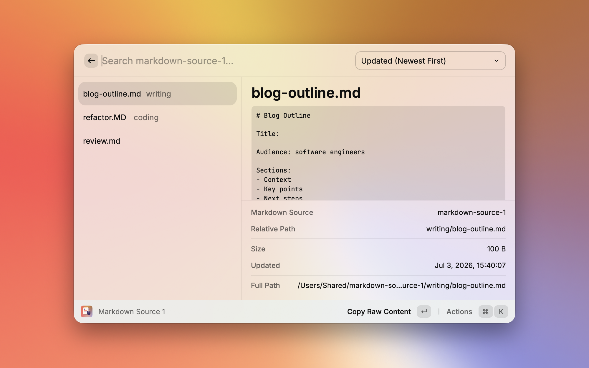

# MdClip

MdClip is a personal/local Raycast extension for finding local Markdown files and copying their contents from Raycast.

Use MdClip when you keep reusable text in Markdown files and want to search, preview, and copy those files from Raycast without changing the originals. Start with the Get Started section below to run the extension locally.



## What It Does

MdClip treats your Markdown files as the source of truth.

- You keep reusable text in normal `.md` files.
- You group those files into up to three Markdown Sources.
- You open a Markdown Source command in Raycast, search the files, preview the selected file, and copy its contents.
- You can copy the raw file contents or copy an expanded version where supported placeholders are replaced at copy time.

MdClip does not create, edit, move, rename, or delete your Markdown files.

## Get Started

For normal use, download `Source code (zip)` from the [latest GitHub Release](https://github.com/uchimanajet7/mdclip/releases/latest). The downloaded source archive is tied to the latest release tag.

```bash
npm ci
npm run dev
```

After `npm run dev` starts, open Raycast and configure at least one Markdown Source folder in the extension preferences.

For the full setup, update, and removal steps, see [Getting Started](docs/getting-started.md).

## Commands

| Command              | Purpose                                                   |
| -------------------- | --------------------------------------------------------- |
| Markdown Source 1    | Browse Markdown files from Markdown Source 1              |
| Markdown Source 2    | Browse Markdown files from Markdown Source 2              |
| Markdown Source 3    | Browse Markdown files from Markdown Source 3              |
| All Markdown Sources | Search Markdown files across all enabled Markdown Sources |

Use individual Markdown Source commands when you know which folder contains the file. Use All Markdown Sources when you want to search every enabled source at once.

Raycast Root Search may show these commands in a different order from this table or from the `package.json` command array. MdClip declares the commands as Markdown Source 1, 2, 3, then All Markdown Sources, but Raycast ranks Root Search results with its own ranking data. If a command appears too high or too low in Root Search, use Raycast's Reset Ranking action. See Raycast's [Search Bar manual](https://manual.raycast.com/search-bar) and [Manifest command properties](https://developers.raycast.com/information/manifest).

## Preferences

Configure at least one enabled Markdown Source folder before using the extension. Each individual folder preference is optional in Raycast, so unused sources can be left empty.

```text
MdClip Preferences
├── Markdown Source 1
│   ├── Enable Markdown Source 1
│   ├── Markdown Source 1 Folder
│   └── Markdown Source 1 Name
├── Markdown Source 2
│   ├── Enable Markdown Source 2
│   ├── Markdown Source 2 Folder
│   └── Markdown Source 2 Name
├── Markdown Source 3
│   ├── Enable Markdown Source 3
│   ├── Markdown Source 3 Folder
│   └── Markdown Source 3 Name
└── Shared Preferences
    ├── Editor
    ├── Preview Line Count
    └── Preview Max Characters
```

| Preference             | Requirement | Description                                                                                                                                                  |
| ---------------------- | ----------- | ------------------------------------------------------------------------------------------------------------------------------------------------------------ |
| Enable Markdown Source | Optional    | Includes or excludes that source from its command and All Markdown Sources                                                                                   |
| Markdown Source Folder | Optional    | Folder containing Markdown files for that source. At least one enabled source needs a folder                                                                 |
| Markdown Source Name   | Optional    | Source display name used inside MdClip lists, sections, and metadata. It does not rename the Raycast Root Search command. The folder name is used when empty |
| Editor                 | Optional    | App used by Open in Editor                                                                                                                                   |
| Preview Line Count     | Optional    | Number of leading lines shown in the preview. Default is `10`, maximum is `100`. Values that cannot be read as a positive integer use the default            |
| Preview Max Characters | Optional    | Maximum number of characters shown in the preview. Default is `4000`, maximum is `20000`. Values that cannot be read as a positive integer use the default   |

## Actions

| Action                | Description                                                                       |
| --------------------- | --------------------------------------------------------------------------------- |
| Copy Raw Content      | Copies the full Markdown file content without changes                             |
| Copy Expanded Content | Replaces supported placeholders in the full Markdown file content, then copies it |
| Show/Hide Preview     | Toggles the preview pane                                                          |
| Open in Editor        | Opens the selected file in the configured editor                                  |
| Open                  | Opens the selected file in the default app when no editor is configured           |
| Open with...          | Opens the selected file with another compatible app                               |
| Show in Finder        | Shows the selected file in Finder                                                 |

`Copy Raw Content` is the default action.

## Dynamic Placeholders

MdClip uses the same `{placeholder}` syntax style as Raycast Dynamic Placeholders. `Copy Expanded Content` expands only the MdClip-supported placeholders listed below. The original Markdown file is not modified.

| Placeholder   | Replacement                                                |
| ------------- | ---------------------------------------------------------- |
| `{date}`      | Current date based on your environment locale              |
| `{time}`      | Current time based on your environment locale              |
| `{datetime}`  | Current date and time based on your environment locale     |
| `{day}`       | Day of the week based on your environment locale           |
| `{timezone}`  | Current time zone in a form such as `Asia/Tokyo UTC+09:00` |
| `{now}`       | Current date and time plus time zone                       |
| `{uuid}`      | Random UUID generated separately for each occurrence       |
| `{clipboard}` | Current clipboard text                                     |

Related replacement model: [Raycast Dynamic Placeholders](https://manual.raycast.com/dynamic-placeholders)

MdClip's placeholder expansion is designed to match the Raycast Dynamic Placeholders replacement model for the supported placeholders listed above.

## Markdown File Handling

MdClip recursively reads files with a `.md` extension, matched case-insensitively.

The following paths are excluded:

- `.git`
- `node_modules`
- hidden directories
- files whose extension is not `.md`

Symbolic links are not followed.

## Data Handling

MdClip reads Markdown files only from folders you configure as enabled Markdown Sources.

Markdown contents are sent to the clipboard only when you run a copy action. The current clipboard text is read only when `Copy Expanded Content` processes a Markdown file containing `{clipboard}`.

MdClip does not make network requests during normal extension use.

## Development And Maintenance

- [Development and maintenance verification](docs/local-verification.md)
- [Maintainer release management](docs/release-management.md)
