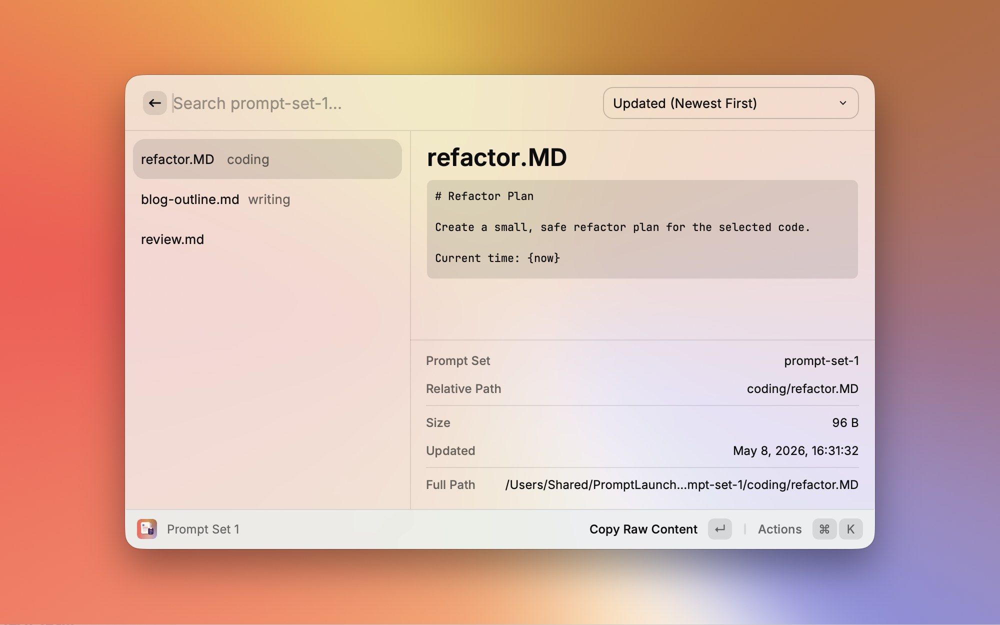

# Prompt Launcher

`Prompt Launcher` is a Raycast extension for finding Markdown prompt files from local folders, then copying their content or opening them in an editor.

It uses your existing Markdown files as they are. You do not need to move your prompts into a Raycast-specific format or manage them inside Raycast.

## What This Extension Solves

If you manage prompts as Markdown files, editing and version history can stay in your usual editor and Git workflow. The missing part is quickly finding a prompt and copying its content when you need to use it.

`Prompt Launcher` focuses on that launch and copy workflow.

- You manage one prompt per Markdown file
- You edit prompts in your usual editor, such as Visual Studio Code
- You keep prompt history in Git or another file-based workflow
- You want Raycast to quickly search, preview, copy, and open existing Markdown prompts

## Features

- Recursively lists Markdown files under enabled and configured folders. The `.md` extension is matched case-insensitively
- Provides three Prompt Set commands for frequently used folders
- Searches across all enabled and configured Prompt Sets
- Copies the full content of the selected Markdown file
- Copies the selected Markdown file after replacing supported Dynamic Placeholders
- Shows an optional preview of the beginning of the selected file
- Opens the selected file in a configured editor, the default app, another compatible app, or Finder
- Sorts the list by updated time, file name, or relative path



## Requirements

Prepare at least one folder that contains Markdown prompt files.

Each Markdown file is treated as one prompt. Frontmatter, special code blocks, or custom separators are not required.

Example:

```text
prompts/
├── review.md
├── refactor.md
└── writing/
    └── blog-outline.md
```

`Copy Raw Content` copies the full content of the selected Markdown file.

## Setup

After installing the extension, open `Prompt Launcher` from Raycast Preferences > Extensions and set at least one of `Prompt Set 1 Folder`, `Prompt Set 2 Folder`, or `Prompt Set 3 Folder`.

You can also open the same preferences screen from `Open Extension Preferences` when a disabled or unconfigured Prompt Set is opened.

You do not need to configure all three Prompt Set Folders. At least one enabled Prompt Set with a configured Prompt Set Folder is required to show Markdown files.

Each Prompt Set appears as its own section in Raycast Preferences. The `Enable Prompt Set N` checkbox controls whether that Prompt Set is included in its command and in `All Prompt Sets`.

```text
Prompt Launcher Preferences
├── Prompt Set 1
│   ├── Enable Prompt Set 1
│   ├── Prompt Set 1 Folder
│   └── Prompt Set 1 Name
├── Prompt Set 2
│   ├── Enable Prompt Set 2
│   ├── Prompt Set 2 Folder
│   └── Prompt Set 2 Name
├── Prompt Set 3
│   ├── Enable Prompt Set 3
│   ├── Prompt Set 3 Folder
│   └── Prompt Set 3 Name
└── Shared Preferences
    ├── Editor
    ├── Preview Line Count
    └── Preview Max Characters
```

| Prompt Set Section | Preference | Requirement | Description |
| --- | --- | --- | --- |
| Prompt Set 1 | Enable Prompt Set 1 | Optional, on by default | Includes `Prompt Set 1` in its command and `All Prompt Sets` |
| Prompt Set 1 | Prompt Set 1 Folder | Required to use `Prompt Set 1` | Markdown folder used by `Prompt Set 1` |
| Prompt Set 1 | Prompt Set 1 Name | Optional | Display name shown in Raycast |
| Prompt Set 2 | Enable Prompt Set 2 | Optional, on by default | Includes `Prompt Set 2` in its command and `All Prompt Sets` |
| Prompt Set 2 | Prompt Set 2 Folder | Required to use `Prompt Set 2` | Markdown folder used by `Prompt Set 2` |
| Prompt Set 2 | Prompt Set 2 Name | Optional | Display name shown in Raycast |
| Prompt Set 3 | Enable Prompt Set 3 | Optional, on by default | Includes `Prompt Set 3` in its command and `All Prompt Sets` |
| Prompt Set 3 | Prompt Set 3 Folder | Required to use `Prompt Set 3` | Markdown folder used by `Prompt Set 3` |
| Prompt Set 3 | Prompt Set 3 Name | Optional | Display name shown in Raycast |

Other preferences apply to all Prompt Sets.

| Preference | Requirement | Description |
| --- | --- | --- |
| Editor | Optional | App used by `Open in Editor`. When unset, `Open` uses the default app |
| Preview Line Count | Optional | Number of leading lines shown in the preview. Default is `10` |
| Preview Max Characters | Optional | Maximum number of characters shown in the preview. Default is `4000` |

If you turn off `Enable Prompt Set N`, that Prompt Set is excluded from its command and from `All Prompt Sets` until you turn it on again.

If you open an enabled Prompt Set command without setting its folder, the extension shows a configuration screen.

If a Prompt Set Name is empty, the configured folder name is used as the display name.

## First Use

1. Open `Prompt Launcher` from Raycast Preferences > Extensions
2. Set `Prompt Set 1 Folder` to a folder that contains Markdown prompt files
3. Keep `Enable Prompt Set 1` turned on
4. Optionally set `Prompt Set 1 Name`
5. Open `Prompt Set 1` in Raycast
6. Select a Markdown file from the list
7. Press Enter to run `Copy Raw Content`

Open `All Prompt Sets` when you want to search across multiple enabled folders.

## Commands

| Command | Description |
| --- | --- |
| Prompt Set 1 | Shows Markdown prompts from `Prompt Set 1 Folder` |
| Prompt Set 2 | Shows Markdown prompts from `Prompt Set 2 Folder` |
| Prompt Set 3 | Shows Markdown prompts from `Prompt Set 3 Folder` |
| All Prompt Sets | Searches Markdown prompts across all enabled and configured Prompt Sets |

Raycast hotkeys can be assigned per command. Assign hotkeys to the Prompt Sets you use most often, and use `All Prompt Sets` when you want to search across enabled folders.

## Actions

The following actions are available when a Markdown file is selected.

| Action | Description |
| --- | --- |
| Copy Raw Content | Copies the full Markdown file content to the clipboard without changes |
| Copy Expanded Content | Replaces supported Dynamic Placeholders in the full Markdown file content, then copies the result |
| Show Preview / Hide Preview | Toggles the preview pane |
| Open in Editor | Shown when `Editor` is configured. Opens the Markdown file in the configured editor |
| Open | Shown when `Editor` is not configured. Opens the Markdown file in the default app |
| Open with… | Opens the Markdown file with another compatible app |
| Show in Finder | Shows the Markdown file in Finder |

`Copy Raw Content` is the default action. Pressing Enter copies the full content of the selected Markdown file.

`Open in Editor` and `Open` are not shown at the same time. When `Editor` is configured, the extension shows `Open in Editor`. When `Editor` is not configured, it shows `Open`.

## Copy Raw Content and Copy Expanded Content

`Copy Raw Content` copies the Markdown file content without changing it.

`Copy Expanded Content` replaces supported Dynamic Placeholders in the Markdown file content before copying. It does not modify the original Markdown file.

Prompt Launcher supports a subset of placeholder names used by Raycast Dynamic Placeholders, plus its own `{timezone}` and `{now}` placeholders. It is not fully compatible with Raycast Dynamic Placeholders, and the replacement values are generated by Prompt Launcher.

Reference: [Raycast Dynamic Placeholders](https://manual.raycast.com/dynamic-placeholders)

Example:

```markdown
Date and time: {datetime}
Time zone: {timezone}
Now: {now}

Clipboard:
{clipboard}
```

When you run `Copy Expanded Content`, `{datetime}` is replaced with the current date and time from your environment, `{timezone}` with the current time zone, `{now}` with the current date and time plus time zone, and `{clipboard}` with the current clipboard text.

If a Markdown file does not use Dynamic Placeholders, `Copy Raw Content` and `Copy Expanded Content` produce effectively the same copied text.

## Dynamic Placeholders

`Copy Expanded Content` replaces only the Dynamic Placeholders listed below.

| Placeholder | Replacement |
| --- | --- |
| `{date}` | Current date based on your environment locale |
| `{time}` | Current time based on your environment locale |
| `{datetime}` | Current date and time based on your environment locale |
| `{day}` | Day of the week based on your environment locale |
| `{timezone}` | Prompt Launcher placeholder for the time zone in `Asia/Tokyo UTC+09:00` format |
| `{now}` | Current date and time from `{datetime}` plus `{timezone}`, separated by a space |
| `{uuid}` | Random UUID |
| `{clipboard}` | Current clipboard text |

Placeholders that are not listed here are not replaced and remain unchanged in the copied text.

## Preview

Preview is enabled by default on first launch.

When preview is shown, the extension displays the beginning of the selected file in Raycast's detail pane. Preview content is not loaded while building the list. It is loaded only for the selected file when needed.

Use `Show Preview` / `Hide Preview` to toggle the preview pane. The selected state is stored in Raycast LocalStorage and restored the next time you use the extension.

## Sort

Use the `Sort` dropdown on the right side of the search bar to change the list order.

| Sort | Description |
| --- | --- |
| Updated (Newest First) | Newest updated files first. This is the default |
| Updated (Oldest First) | Oldest updated files first |
| Name (A-Z) | File name ascending |
| Path (A-Z) | Relative path from the Prompt Set Folder ascending |

## Markdown File Handling

The extension recursively reads Markdown files under enabled and configured folders. Files are included when their extension is `.md`, matched case-insensitively. Examples include `.md`, `.MD`, `.Md`, and `.mD`.

The following files and folders are excluded from the list.

- Files under `.git`
- Files under `node_modules`
- Files under hidden directories
- Files whose extension is not `.md`, matched case-insensitively

Symbolic links are not followed.

## Troubleshooting

### A Prompt Set asks me to configure preferences

The Prompt Set is disabled or its folder is not configured. Open Raycast Extension Preferences, turn on the Prompt Set if needed, and set the Prompt Set Folder.

### Markdown files are not shown

Check the following.

- The Prompt Set Folder points to the correct folder
- The file extension is `.md`, matched case-insensitively
- The file is not under `.git`, `node_modules`, or a hidden directory
- The folder exists and can be read by Raycast

### A configured folder fails to load

The configured path may not be a folder, the folder may have been deleted or moved, or Raycast may not be able to read it. Open Extension Preferences and set the Prompt Set Folder again.

### `Open in Editor` does not open the expected app

Check the `Editor` preference. When `Editor` is not configured, the action is shown as `Open` and the Markdown file opens in the default app.

### `Copy Expanded Content` gives an unexpected result

Only the placeholders listed in the Dynamic Placeholders table are replaced. Placeholders that are not listed remain unchanged in the copied text.

When `{clipboard}` is used, the clipboard text at the time of copying is inserted into the copied result.

## Privacy and Data Handling

`Prompt Launcher` reads Markdown files under the enabled Prompt Set Folders that you configure.

Markdown file content is sent to the clipboard only when you run a copy action.

When you use `Copy Expanded Content`, the current clipboard text is read only if the Markdown file content contains `{clipboard}`.

The preview visibility state is stored in Raycast LocalStorage.

This extension does not make network requests.

## File Safety

`Prompt Launcher` does not create, edit, rename, move, or delete Markdown files. It does not perform Git operations or sync files to a cloud service.
